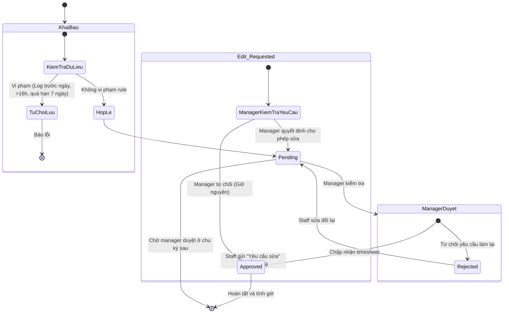
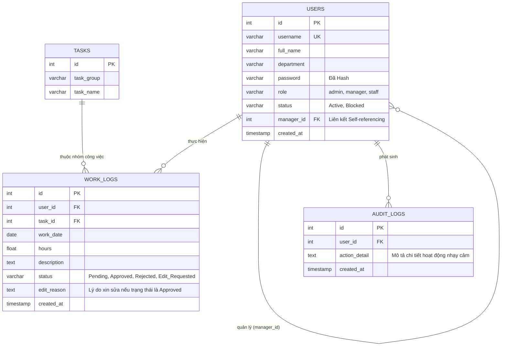

# 🚀 HỆ THỐNG QUẢN LÝ BÁO CÁO CÔNG VIỆC VÀ THEO DÕI HIỆU SUẤT (TIMESHEET MANAGEMENT SYSTEM)

[](https://react.dev/)
[](https://vite.dev/)
[](https://ant.design/)
[](https://nodejs.org/)
[](https://www.mysql.com/)

Tài liệu này cung cấp chi tiết toàn bộ kiến trúc, lý thuyết, thiết kế cơ sở dữ liệu, quy trình nghiệp vụ và hướng dẫn cài đặt chạy thử dự án **Timesheet Management System**, phục vụ cho việc vận hành và báo cáo đồ án / luận văn tốt nghiệp.

---

## 🛠️ PHẦN 1. HƯỚNG DẪN CÀI ĐẶT & CHẠY DỰ ÁN (INSTALLATION & RUNNING)

### 1.1 Chuẩn bị Cơ sở dữ liệu (MySQL Database)
1. Cài đặt và mở **MySQL Server** (hoặc thông qua MySQL Workbench).
2. Tạo mới một schema tên là `timesheet_db` hoặc chạy trực tiếp file script khởi tạo:
   - File script thiết lập DB: [database_setup.sql](/database_setup.sql)
3. Chạy toàn bộ script trong file trên để thiết lập cấu trúc các bảng (`users`, `tasks`, `work_logs`, `kpi_settings`, `audit_logs`) và chèn tài khoản Admin mặc định ban đầu.

### 1.2 Cấu hình & Chạy Backend (Server API)
1. Di chuyển vào thư mục `backend`:
   ```bash
   cd backend
   ```
2. Cài đặt các package phụ thuộc:
   ```bash
   npm install
   ```
3. Tạo file cấu hình môi trường `.env` nằm trong thư mục `backend/` với các thông số kết nối cơ sở dữ liệu của bạn:
   ```env
   DB_HOST=localhost
   DB_PORT=3306
   DB_USER=root
   DB_PASSWORD=your_mysql_password
   DB_NAME=timesheet_db
   PORT=3000
   ```
4. Khởi chạy Server:
   ```bash
   node server.js
   ```
   *Mặc định API sẽ chạy tại: `http://localhost:3000`*
   *Tài liệu API Swagger tự động sinh ra tại: `http://localhost:3000/api-docs`*

### 1.3 Cấu hình & Chạy Frontend (Client UI)
1. Di chuyển vào thư mục `frontend`:
   ```bash
   cd frontend
   ```
2. Cài đặt các package phụ thuộc:
   ```bash
   npm install
   ```
3. Khởi chạy Client ở chế độ Development:
   ```bash
   npm run dev
   ```
   *Mặc định giao diện Web sẽ hoạt động tại: `http://localhost:5173` (hoặc IP hiển thị trong terminal)*

---

## 🔑 PHẦN 2. DANH SÁCH TÀI KHOẢN DEMO (DEMO ACCOUNTS)

Hệ thống được cấu hình sẵn một số tài khoản đại diện cho các vai trò để bạn dễ dàng thử nghiệm toàn bộ luồng nghiệp vụ:

| Vai trò (Role) | Tài khoản (Username) | Mật khẩu (Password) | Ghi chú / Quyền hạn |
| :--- | :--- | :--- | :--- |
| **Admin** | `admin` | `123456` | Quản trị viên tối cao: Quản lý người dùng, phân vai trò, gán quản lý trực tiếp, Block/Active tài khoản. |
| **Manager** | `manager` | `123` | Người quản lý: Duyệt/Từ chối chấm công của nhân viên cấp dưới, xem biểu đồ thống kê KPI, chấm công hộ nhân viên. |
| **Staff** | `staff` | `123` | Nhân viên: Khai báo báo cáo chấm công (Timesheet), theo dõi KPI cá nhân, yêu cầu sửa khi đã duyệt. |

> [!TIP]
> Tất cả các mật khẩu được lưu trữ trong cơ sở dữ liệu đều được mã hóa một chiều bằng thuật toán `bcryptjs`, đảm bảo an toàn tuyệt đối.

---

## 📋 PHẦN 3. QUY TRÌNH & NGHIỆP VỤ HỆ THỐNG (BUSINESS WORKFLOW)

### 3.1 Quy trình, luồng nghiệp vụ (Business Flow)

Quy trình quản lý chấm công và báo cáo công việc hàng ngày trong hệ thống tuân theo các bước chính sau:

1. **Khởi tạo hệ thống & Phân quyền:** Admin quản trị ứng dụng tiến hành tạo mới tài khoản cho các Nhân viên (Staff) và Quản lý (Manager). Mỗi Staff được gán trực tiếp dưới quyền giám sát của một Manager cụ thể thông qua liên kết `manager_id`.
2. **Khai báo và Nộp báo cáo (Timesheet):** Hàng ngày hoặc hàng tuần, Staff đăng nhập vào hệ thống để ghi nhận (log) số giờ làm việc, chọn Task tương ứng và ghi chú. 
   - Hệ thống có cơ chế kiểm duyệt chặt chẽ (Validation): không cho phép chấm công cho ngày ở tương lai, không được phép vượt quá 16h/ngày và tiến hành khóa sổ nếu quá hạn 7 ngày.
3. **Phê duyệt Báo cáo (Approval Process):** 
   - Bản ghi vừa tạo sẽ mặc định ở trạng thái `Pending` (Chờ duyệt).
   - Manager truy cập Dashboard để xem thống kê và xét duyệt. Manager có thể `Approve` (Duyệt) hoặc `Reject` (Từ chối).
4. **Yêu cầu Sửa đổi (Request Edit):**
   - Nếu bản ghi đang `Pending` hoặc `Rejected`, Staff có quyền sửa lại thông tin tự do, trạng thái sẽ tự cập nhật về `Pending`.
   - Nếu bản ghi đã `Approved`, Staff KHÔNG thể tự sửa. Thay vào đó, Staff phải dùng chức năng "Yêu cầu sửa" (Request Edit) kèm theo lý do bắt buộc. Trạng thái bản ghi chuyển sang `Edit_Requested`.
   - Manager xét duyệt yêu cầu này: Nếu đồng ý cho sửa, trạng thái trả về `Pending`, nhân viên có thể thay đổi dữ liệu; nếu từ chối, bản ghi tiếp tục giữ nguyên `Approved`.
5. **Giám sát & Thống kê:** Manager và Admin có thể xem được bảng KPI đánh giá hiệu suất (dựa trên tổng số tiếng đã được xét duyệt `Approved`). Mọi hành động nhạy cảm như thêm, sửa, xóa, duyệt, khóa user đều được hệ thống backend lưu lại vết tính toàn vẹn thông qua bảng `Audit Log` (Nhật ký thao tác).

### 3.2 Biểu đồ Use Case (Use Case Diagram)

Hệ thống xoay quanh 3 tác nhân (Actor) chính: **Admin**, **Manager** và **Staff**.

```mermaid
usecaseDiagram
    actor "Staff (Nhân viên)" as staff
    actor "Manager (Quản lý)" as manager
    actor "Admin (Quản trị viên)" as admin

    package "Hệ thống Timesheet" {
        usecase "Đăng nhập / Đổi mật khẩu" as UC1
        
        usecase "Khai báo Timesheet" as UC2
        usecase "Xem lịch sử làm việc" as UC3
        usecase "Yêu cầu sửa bản ghi Approved" as UC4
        
        usecase "Duyệt / Từ chối Timesheet" as UC5
        usecase "Xem Dashboard thống kê KPI" as UC6
        usecase "Nhập hộ Timesheet cho Staff" as UC7
        usecase "Duyệt yêu cầu sửa (Edit Request)" as UC8
        
        usecase "Quản lý User (CRUD, Phân quyền)" as UC9
        usecase "Quản lý phân công (Gán Manager)" as UC10
        usecase "Khóa / Mở khóa tài khoản" as UC11
    }

    staff --> UC1
    staff --> UC2
    staff --> UC3
    staff --> UC4

    manager --> UC1
    manager --> UC5
    manager --> UC6
    manager --> UC7
    manager --> UC8

    admin --> UC1
    admin --> UC9
    admin --> UC10
    admin --> UC11
```
*(Ghi chú: Lược đồ trên là đại diện trực quan cho các chức năng tương tác trực tiếp với hệ thống tương ứng với các user role)*

### 3.3 Activity Diagram (Biểu đồ hoạt động: Luồng khai báo và duyệt Timesheet)

Luồng nghiệp vụ xử lý vòng đời của một dòng Timesheet (Khai báo -> Xét duyệt -> Yêu cầu sửa):



---

## 🗄️ PHẦN 4. THIẾT KẾ CƠ SỞ DỮ LIỆU (DATABASE DESIGN)

Hệ thống sử dụng cơ sở dữ liệu quan hệ (RDBMS) MySQL. Các bảng được liên kết với nhau bằng Foreign Key chặt chẽ.

### 4.1 Sơ đồ thực thể ERD (Entity-Relationship Diagram)



### 4.2 Chi tiết một số thiết kế đặc thù

1. **Bảng `users`**: Lưu trữ mọi tài khoản trên hệ thống. 
   - `role`: Xử lý logic phân quyền trên Frontend (cắt/hiện menu) và tại Backend (cấm/cho phép truy cập API).
   - `manager_id`: Khóa ngoại tự tham chiếu (Self-referencing Foreign Key). Một User có Manager ID trỏ về một User khác đóng vai trò là "manager". Điều này giúp CSDL có khả năng thể hiện cấu trúc cây nhân sự phức tạp (Tree-structure).
2. **Bảng `work_logs`**: Sổ cái trung tâm của hệ thống. 
   - Cột `status` và `edit_reason` đóng vai trò quản lý máy trạng thái (State Machine) của một dòng chấm công, giúp phân loại được thời gian nào được tính vào KPI, thời gian nào đang chờ duyệt.
3. **Bảng `audit_logs`**: Nhật ký hệ thống kiểm toán tự động.
   - Bất kỳ thao tác thay đổi dữ liệu nhạy cảm (Cập nhật trạng thái log, xóa record, xóa user, sửa user) đều được middleware backend insert bản ghi có text mô tả hành động, giúp Admin truy vết lịch sử trách nhiệm hệ thống rất dễ dàng.

---

## 🏗️ PHẦN 5. TỔNG QUAN SẢN PHẨM & KIẾN TRÚC HỆ THỐNG

### 5.1 Kiến trúc Decoupled Client-Server

Dự án được xây dựng tuân thủ kiến trúc **Client-Server độc lập (Decoupled Client-Server Architecture)** với giao tiếp giữa 2 thành phần dựa trên tiêu chuẩn **RESTful API**. 
Đây là một mô hình thiết kế hiện đại, giúp quá trình bảo trì và mở rộng hệ thống đạt độ linh hoạt tối đa; cho phép bộ phận Frontend (UI) và bộ phận Backend (Xử lý nghiệp vụ) có thể code, kiểm thử, và triển khai (Deploy) hoàn toàn tách biệt trên các Server khác nhau.

* **Client (Frontend):** Đóng vai trò là "Tầng trình diễn" (Presentation Layer), được xây dựng dưới dạng ứng dụng trang đơn - Single Page Application (SPA). Toàn bộ thao tác định vị và hiển thị nội dung (Routing) được xử lý ngay tại V8 JavaScript Engine trên trình duyệt của người dùng mà không cần phải gọi tải lại toàn bộ trang từ máy chủ.
* **Server (Backend):** Đóng vai trò là "Tầng xử lý nghiệp vụ" (Business Logic Layer) và "Truy cập dữ liệu" (Data Access Layer). Nó phơi bày (expose) các điểm cuối API. Backend hoạt động hoàn toàn phi trạng thái (Stateless); mỗi request gửi lên sẽ tự mang kèm định danh; Server nhận Request (JSON format), xử lý, check quyền, tương tác MySQL và trả ngược lại mã lỗi định dạng JSON.

---

## 💻 PHẦN 6. FRONTEND, BACKEND VÀ CÔNG NGHỆ SỬ DỤNG

### 6.1 Frontend - Giao diện người dùng
* **Công nghệ cốt lõi:** Ngôn ngữ JavaScript, xây dựng bằng thư viện **ReactJS** kết hợp với công cụ build **Vite** (Vite hỗ trợ Hot Module Replacement cực nhanh và biên dịch tối ưu).
* **Quản lý state & định tuyến:** Sử dụng React Hooks (`useState`, `useEffect`) và `react-router-dom` để tạo trải nghiệm ứng dụng liền mạch (SPA).
* **Giao tiếp HTTP:** Cấu hình thư viện `Axios` để thực hiện call API. Áp dụng kỹ thuật gửi kèm Headers (`x-user-id`) phục vụ việc ủy quyền người thao tác.
* **Hình thức (UI Framework):** Sử dụng các component đến từ thư viện **Ant Design** (AntD) cho các Table, Modal mượt mà; Kết hợp thư viện **Bootstrap** cùng Custom CSS (Flexbox, Grid) để tổ chức bộ cục nhanh chóng. Thư viện **Day.js** được áp dụng để làm việc, so sánh, tính toán múi giờ và ngày tháng chuẩn xác.

**Các khối module chức năng (Frontend):**
1. **Module Đăng nhập (`Login.jsx`, `App.jsx`):** Lưu trữ định danh trong LocalStorage, khôi phục lại phiên làm việc (Persist Login) để chống mất state khi refresh, thực hiện chuyển hướng dựa trên Rule Engine.
2. **Khối Staff (`Timesheet.jsx`, `MonthlyView.jsx`):** Giao diện Calendar dạng Data Grid để nhập khối lượng, tích hợp các "Alert" động cảnh báo các ngày bị trống dữ liệu trong tháng.
3. **Khối Manager (`ManagerDashboard.jsx`):** Giao diện Control Panel giúp quản lý nhanh Data Log của nhân viên cấp dưới, Approve/Reject nhanh chóng. Dashboard hiển thị bảng báo cáo (Total Hours).
4. **Khối Admin (`AdminDashboard.jsx`):** Bảng quản lý tập trung toàn diện theo cơ chế CRUD, có khả năng search, filter và thiết lập quản lý rủi ro (Block user).

### 6.2 Backend - Xử lý nghiệp vụ & Bảo mật
* **Công nghệ cốt lõi:** **Node.js** làm môi trường thực thi (Runtime), sử dụng Web Framework **Express.js** để tạo hình các Router/Controller.
* **Database Driver:** Sử dụng package `mysql2`. Điểm đặc biệt của kiến trúc là quy chuẩn sử dụng **Connection Pool** `mysql.createPool({ connectionLimit: 10 })`, giúp tái sử dụng và giải phóng các luồng kết nối DB liên tục, chống gây sập Database khi scale app.
* **Xác thực bảo mật thông tin (Password Hashing):** Sử dụng thuật toán một chiều `bcryptjs` kết hợp (genSaltSync) để băm (Hash) mật khẩu ngay trước khi lưu. Ngay cả Admin cũng không thể đọc bản Raw mật khẩu của Staff.
* **Kiểm duyệt & Bảo mật (Middleware Filter Layer):** Backend thiết lập một chuỗi Filter Pipeline ở trên cùng. Mọi request đi tới API bị buộc phải quét Header lấy thông tin user id. Hệ thống kiểm tra trực tiếp vào Database xem user đó có đang tồn tại, hoặc bị `Blocked` (khóa) hay không. Nếu có yếu tố vi phạm hoặc bị Admin khóa rủi ro, hệ thống chặn 100% Request với mã lỗi 403 Forbidden bất chấp việc UI frontend chưa kịp cập nhật hoặc có người cố tình Bypass qua Postman.

### 6.3 Kiến trúc mã nguồn chi tiết

Hệ thống sử dụng triết lý phân chia tệp mã nguồn theo Component-based và Modularity (Module hóa). 

```text
DoAnTotNghiep/
├── frontend/                     # TẦNG FRONTEND
│   ├── src/
│   │   ├── components/           # Tập hợp các React Component tách rời
│   │   │   ├── AdminDashboard.jsx # Controller view cho Admin
│   │   │   ├── Login.jsx         
│   │   │   ├── Timesheet.jsx     # View xử lý biểu mẫu chấm công  
│   │   │   └── ...
│   │   ├── axiosConfig.js        # Cấu hình trung tâm Interceptor cho HTTP Request.
│   │   ├── App.jsx               # Lõi điều hướng (Router), Rule Engine.
│   │   └── index.css             # Tập hợp quy tắc Stylesheet Global.
│   ├── package.json              # File manifest quản lý Version Dependencies.
│   └── vite.config.js
│
├── backend/                      # TẦNG BACKEND 
│   ├── server.js                 # LÕI CỦA BACKEND - Chứa toàn bộ Setup, Routing, Middleware chặn, Controller Logic phục vụ API.
│   ├── database_setup.sql        # Kịch bản SQL DDL/DML chuẩn hóa kiến trúc DB.
│   └── .env                      # File chứa Biến môi trường. (An toàn cấu hình ngoài CSDL).
```
